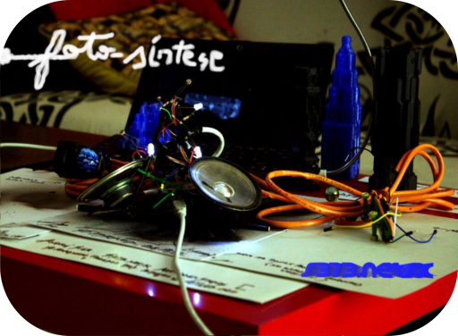

## Foto-Synthesis
## Physical Computing Workshop and Introduction to Arduino and Processing  Programming
### Introduction
An experimentation workshop with simple physical computing interfaces and an introduction to programming. Priority is given to the capture of light through Arduino and its transformation in Processing into sound and image, creating luminous audio-visual instruments. We will also learn how to create joysticks with common objects, create serial communication protocols between objects and programs, bring computing to the real world and back to the virtual one. In the workshop, projects that exemplify these areas that you can apply in your projects will be demonstrated and commented on.

### Objectives
- Elementary knowledge of physical computing circuits and Arduino programming;
- Basic knowledge of Processing programming to generate sounds and images;
- Interconnection of Arduino and Processing through serial protocols;
- Creation of the audio-visual instrument with common and/or light-sensitive objects.

### Program
- Introduction to programming with Arduino and Processing; Programming by objects: Classes in Arduino and Processing;
- Read and use multiple sensors simultaneously; Operate several actuators simultaneously;
- Generate sounds and lights in Arduino. Generate sounds and images in Processing;
- Creation of standalone interactive audio-visual objects in Arduino;
- Introduction to the Serial communication protocol;
- Bidirectional communication of multiple sensors and orders between Arduino and Processing. Examples of protocols;
- Creation of joysticks with metallic objects and Arduino;
- Use of joysticks to create drawing machines and sound machines in Processing from the light captured in Arduino;
- Computer vision in Processing linked to the creation of light and sound patterns in Arduino;
- Creation and assistance in carrying out individual projects.

### Workshops
- 2016 Foto-Síntese, MILL, Lisboa 
- 2015 Foto-Síntese, DAR, Caldas da Rainha 
- 2013 Foto-Síntese, Festival Cidade Preocupada, Montemor-o-Novo 

### License
- (c) 2013-14 s373.net/x, (c) 2022 ArteCódigo
- MIT